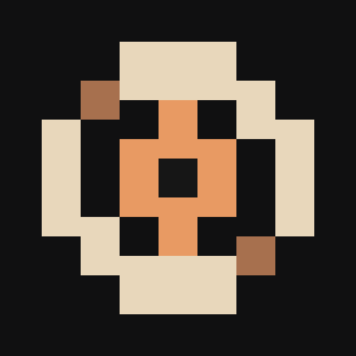
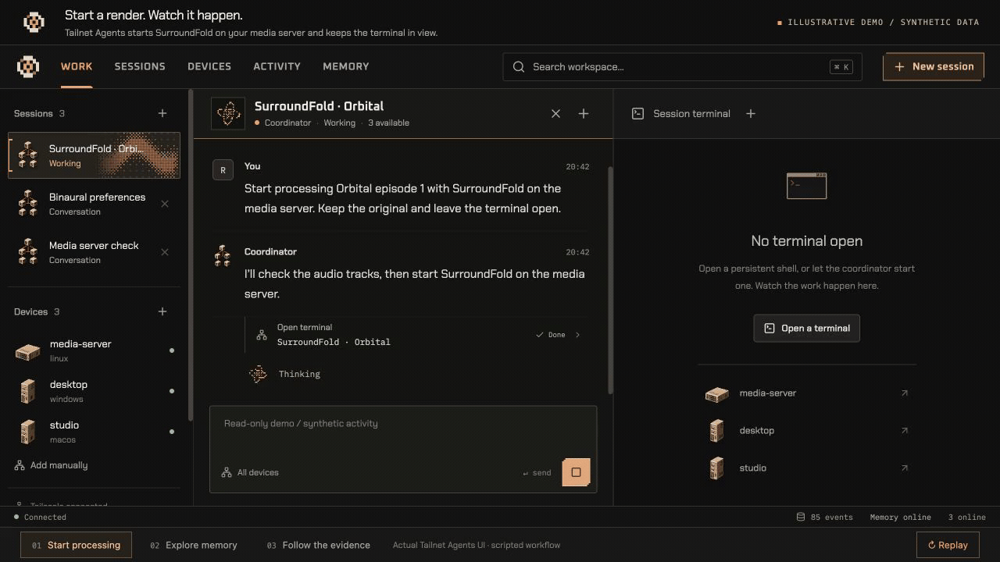

<p align="center">
  
</p>

<h1 align="center">Tailnet Agents</h1>

<p align="center">
  A personal workspace for your agents, machines, and memory.<br>
  Self-hosted, connected over Tailscale, and built to show its work.
</p>

<p align="center">
  <a href="#install">Install</a> ·
  <a href="docs/self-hosting.md">Self-hosting</a> ·
  <a href="#mobile">Mobile</a> ·
  <a href="docs/agents-and-views.md">Agents & views</a> ·
  <a href="docs/architecture.md">Architecture</a> ·
  <a href="CONTRIBUTING.md">Development</a>
</p>

<p align="center">
  <a href="docs/demo/surroundfold.mp4">
    
  </a>
</p>

<p align="center">
  <a href="docs/demo/surroundfold.mp4">Watch the 35-second demo</a> ·
  <a href="docs/demo/README.md">Try the walkthrough locally</a><br>
  <sub>Actual Tailnet Agents UI. Scripted SurroundFold workflow with synthetic media, devices, and activity.</sub>
</p>

## What is Tailnet Agents?

Tailnet Agents brings a built-in coordinator (Codex or Claude), your SSH devices, and persistent terminals
into one browser workspace. Run it on a home server, open it from your laptop
or phone, and ask it to work across your machines.

Each session has its own conversation and, when needed, one terminal. Watch the
agent work, inspect its commands and results in the chat, or take control of
the shell yourself. Closing a session stops its agent and terminal; closing a
browser leaves the work running.

Conversations, tool calls, and terminal output are recorded in Vecgra. Search
past work by meaning or exact text, explore the memory graph, and jump from a
result back to the session that produced it.

## Highlights

- Per-conversation Codex or Claude coordinators with native tools and workspace delegation
- Automatic discovery of Tailscale SSH devices using their short connection names
- One persistent, Ghostty-powered terminal per session, with scrollback while watching
- Commands, diffs, sources, screenshots, and generated images directly in the chat
- Qwen semantic search and an interactive Vecgra graph of your work
- Native Codex, Copilot and Claude sessions on your devices, with coordinator delegation
- Persistent, interactive agent-created views embedded in chat
- A mobile PWA with push notifications for finished work and requests for input
- Copper accents, pixel hardware, and dithered animations tied to real agent activity

Tailnet Agents is an early alpha. Native agents use their existing device installation and sign-in; automatic installation is deferred. See [agents, custom views and notifications](docs/agents-and-views.md) for protocol requirements and usage.

## Install

Tailnet Agents’ server runs on macOS or Linux. Remote shell hosts need SSH and tmux;
Windows devices can expose an SSH endpoint through WSL.

Install these prerequisites before running setup:

- Node.js 24+ and npm
- Rust through rustup; the toolchain is pinned in `rust-toolchain.toml`
- Python 3.12+ and uv
- tmux 3.x
- Codex CLI, authenticated with `codex login`

Clone the repository, then run setup:

```sh
git clone https://github.com/r-firth/tailnet-agents.git
cd tailnet-agents
./scripts/setup.sh
cp .env.example .env
npm run build
./scripts/start.sh
```

Open **http://127.0.0.1:4318**. Setup installs project dependencies and the
pinned WASM build tooling. Add `OPENROUTER_API_KEY` to `.env` for semantic
memory: Tailnet Agents uses Qwen3-Embedding-8B through OpenRouter for both indexing and
search queries. Without a key, exact text search and the graph remain available.

For access from other devices, follow the [self-hosting guide](docs/self-hosting.md).
It covers private Tailscale HTTPS, authentication, SSH setup, and backups.

## See the work

Ask the coordinator to use a device, or open a terminal in the current session.
Its actions appear inline, with expandable commands, output, exit status,
file changes, and web sources. The coordinator runs on the Tailnet Agents host. Native Codex, Copilot and Claude sessions run on the selected device; terminals provide visible, persistent shells there.

Use **Take control** to type in the terminal. You can scroll back while the
agent owns it, and the most recently focused viewer sets its dimensions.
**Stop agent** cancels the turn; **Close session** also ends its terminal.
Closed conversations remain searchable without restarting their shells.

## Memory

Press **Cmd/Ctrl+K** to search, or open **Memory** to navigate Vecgra's nodes
and directed relationships. Switch between network and sequence arrangements,
inspect recorded events, and open the source session from a search result.
The graph and text index stay on the Tailnet Agents server. Embedding requests send the
indexed text and search queries to OpenRouter; returned vectors are stored in
Vecgra. See [embedding configuration](docs/self-hosting.md#semantic-memory).

## Mobile

Open your workspace’s HTTPS address on a phone connected to Tailscale, then choose
**Install Tailnet Agents** in the sidebar. Android Chrome also offers installation from
its browser menu; on iPhone or iPad, use **Share → Add to Home Screen**.

The installed app keeps the same pixel styling, with touch controls and separate
Chat and Terminal views. Live work requires a connection to an awake Tailnet Agents host.
See [mobile installation](docs/self-hosting.md#mobile-installation) for details.

## Development

```sh
npm run dev       # UI on :4317, API on :4318
npm run check     # Tests, builds, and isolated integration checks
```

The frontend uses React, TypeScript, and Vite. Rust/Axum serves the API, streams
events, and owns terminal connections; a Python worker hosts the provider SDKs.
Rust/wgpu supplies the WebGPU activity instruments, with matching Canvas 2D
rendering when WebGPU is unavailable.

See [CONTRIBUTING.md](CONTRIBUTING.md) for checks and fixtures, and
[Architecture](docs/architecture.md) for persistence and runtime boundaries.

## License

A project-wide license has not been selected yet. Vendored Vecgra retains its
[Apache 2.0 license](vendor/vecgra/LICENSE), and bundled Nerd Fonts retain their
[license](web/public/fonts/NERD-FONTS-LICENSE) and
[attribution](web/public/fonts/NERD-FONTS-README.md).

## Claude sessions

Choose **Coordinator → Claude** for a host-side coordinator, or **Claude** for a
native session bound to a registered device and absolute project directory.
Existing conversations retain Codex as their coordinator backend. Role and provider
are separate: a Claude coordinator can delegate to any supported provider; native
sessions cannot delegate, regardless of provider. Follow-ups resume the saved
Claude session ID on its original device and project.

Install the official Claude Code CLI yourself on every execution machine and run
`claude auth login` there using your Claude subscription. For manual code entry
over SSH on CLI versions before 2.1.126, use `claude /login` and select the Claude
subscription option. The hub service must run
as that same OS user with `claude` on PATH. Discovery reports installation, not
successful authentication. No credentials are copied from your workstation to a
remote machine. The adapter checks the CLI's authentication status, requires
`claude.ai`, clears API/alternate-provider authentication environment variables,
and uses a per-process `forceLoginMethod: claudeai` setting. It never invokes
`--bare`, chooses an API fallback, or uses the SDK-bundled CLI.
Account-side limits and billing settings remain controlled by Anthropic.

`HUB_MODEL` remains Codex-only. Claude defaults to `claude-opus-5-5` (Opus 5.5)
with explicit `medium` effort for both coordinator and native sessions. Optional
`HUB_CLAUDE_MODEL` overrides the model. Opus 5.5 requires Claude Code 2.1.280 or
later on every execution device; the app does not upgrade installed CLIs. No machine-wide settings
are written. User/project Claude settings, skills and tools are loaded normally.
Claude runs with `bypassPermissions`; Codex runs with approval policy `never` and
`danger-full-access`. These settings apply to new and resumed coordinator/native
sessions, locally and over SSH. Tool execution does not require approval.
`AskUserQuestion` clarification requests still appear in the conversation. The stop button interrupts Claude before the
worker process group is terminated as a cleanup fallback.

Remote execution uses the pinned official Python Agent SDK on the hub, with its
stdio transport carried over SSH to the unmodified `claude` CLI on the selected
machine. Remote Python/SDK installation is unnecessary. An SSH reverse forward
provides the existing conversation-scoped workspace MCP endpoint, so the remote
SSH server must permit loopback reverse forwarding. Tailscale reauthentication is
shown in chat before launch. This uses registered-device SSH, not Anthropic's
separate Remote Control or cloud session services. The SDK transport adapter uses
a pinned internal command builder; upgrade it together with its protocol tests.

After updating project dependencies (`uv sync --project agent --group dev`), run
`npm run check`. An optional live check uses subscription capacity:

```sh
agent/.venv/bin/python scripts/claude-smoke.py
```

It checks structured coordinator output, native streaming and session resume in a
temporary project without restarting the running service. Remote protocol tests
use a simulated SSH executable; a real remote smoke check additionally requires a
registered machine with a working subscription sign-in and SSH forwarding.

Implementation references (verified September 26, 2026):
[Agent SDK Python interface](https://code.claude.com/docs/en/agent-sdk/python),
[CLI flags](https://code.claude.com/docs/en/cli-reference),
[streaming](https://code.claude.com/docs/en/agent-sdk/streaming-output),
[sessions and resume](https://code.claude.com/docs/en/agent-sdk/sessions),
[permissions and user input](https://code.claude.com/docs/en/agent-sdk/user-input),
and [subscription authentication and usage](https://support.claude.com/en/articles/15036540-use-the-claude-agent-sdk-with-your-claude-plan).
The subscription article's June 15 update pauses the proposed SDK billing changes;
its older proposal remains below the update for reference.
